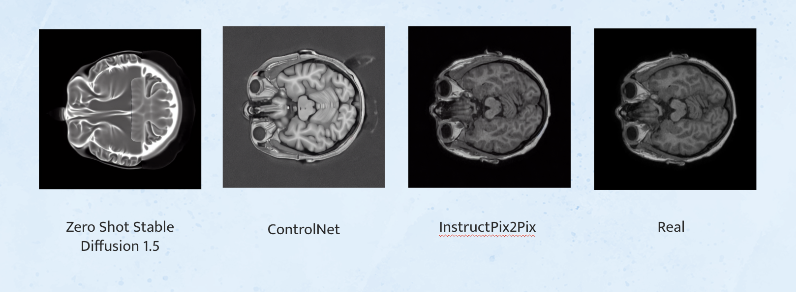
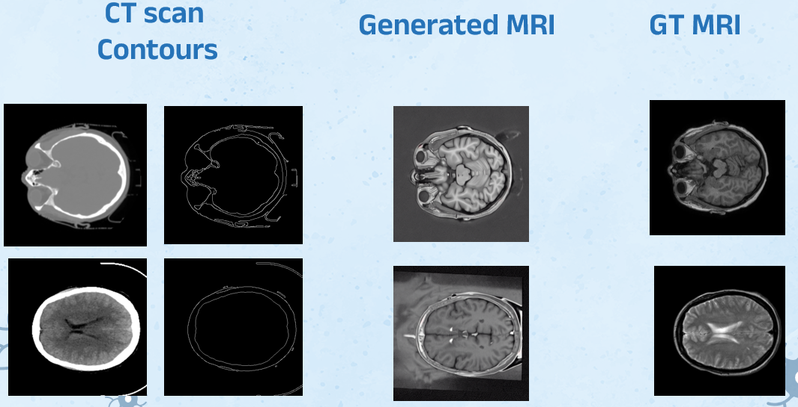
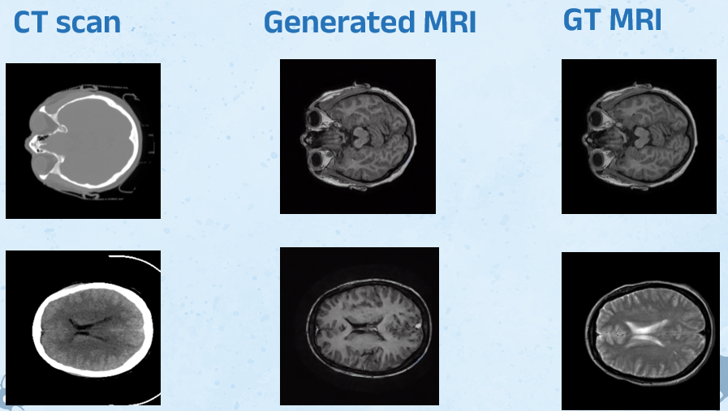
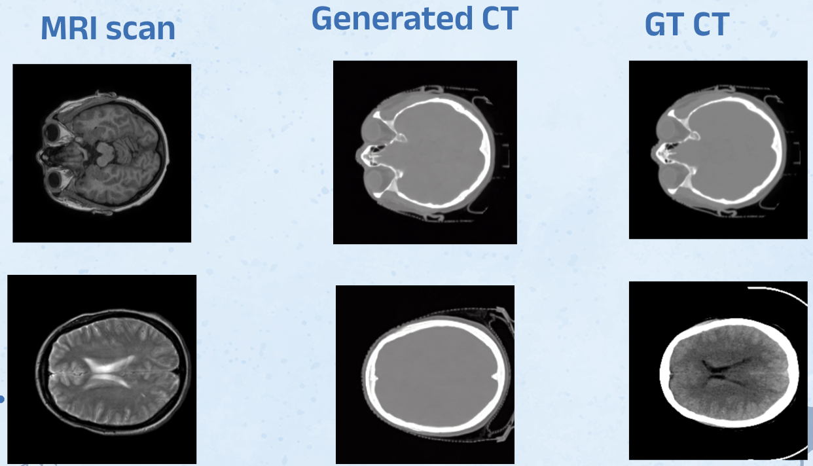
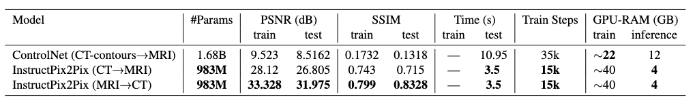
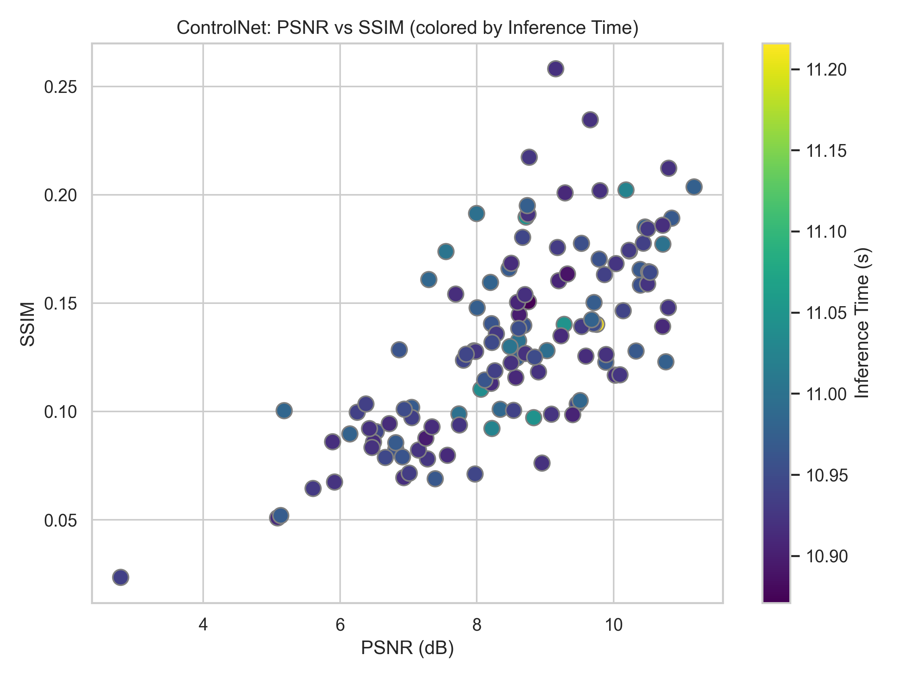
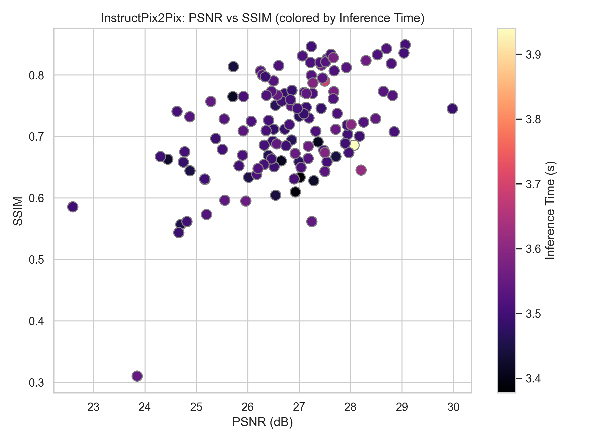
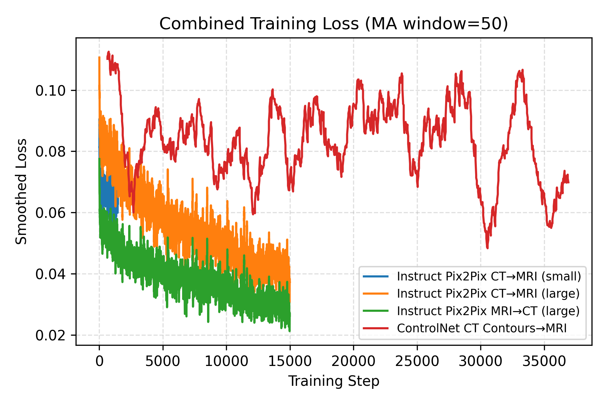

# 🖼️ Mediffuse: CT ↔️ MRI Diffusion-Driven Cross-Modal Translation

[](https://www.python.org/) [](https://d969b2857f0f723529.gradio.live/) [](https://huggingface.co/sauravdosi) 

---

## 🚀 Workflow


A quick overview of the end-to-end pipeline:

1. **Data Preparation:** Load paired CT–MRI scans, preprocess and tokenize.  
2. **Model Training:** Fine-tune diffusion models (InstructPix2Pix & ControlNet).  
3. **Inference:** Generate CT→MRI or MRI→CT translations via scripts or interactive Gradio.  
4. **Evaluation:** Quantitative (PSNR, SSIM) and qualitative (visual samples).

---

## 🚀 Features

- 🔄 Bidirectional Translation: Seamlessly convert CT → MRI and MRI → CT with a single command.

- 🤖 Multi-Model Support: Zero-shot Stable Diffusion 1.5, ControlNet-guided diffusion, and InstructPix2Pix fine-tuned pipelines.

- 🧠 Adaptive Conditioning: Leverage segmentation masks, edge maps, or textual prompts to guide generation.

- ⚡ High Throughput: Fast GPU-accelerated inference achieving <1s per image on modern hardware.

- 📊 Quantitative & Qualitative Evaluation: Built-in PSNR/SSIM computation and side-by-side visual results.

- 🔧 Configurable Workflows: Easily customize hyperparameters, conditioning inputs, and output resolutions.

- 🎨 Interactive Demo: Intuitive Gradio interface to tweak prompts, strength, and masks in real time.

---

## 🖼️ Results

### Comparative:


### CT → MRI (ControlNet):



### CT → MRI (InstructPix2Pix):



### MRI → CT (InstructPix2Pix):



*Check out more examples in the `results/` folder or try the live demo above.*

---

### Quantitative:




## Evaluation:

### ControlNet:



### InstructPix2Pix:



### Combined Loss:



## 📦 Installation

Ensure you have Python 3.10 and Conda installed.

```bash
conda create -n mediffuse python=3.10 -y  
conda activate mediffuse  
pip install -r requirements.txt
```

Download/Use datasets and weights:

### Datasets:

1. CT2MRI-img2img: https://huggingface.co/datasets/sauravdosi/ct2mri-img2img-train
2. CT2MRI-contour2img: https://utdallas.box.com/s/4e70var2i1n53wfb5lk3g9wtyb91t3r6
3. MRI2CT-img2img: https://huggingface.co/datasets/sauravdosi/mri2ct-img2img-train
4. Out of Distribution: https://utdallas.box.com/s/mb8dm3kypa2mf008nkqacbhmlosq3m19

### Fine-tuned Weights: Box

1. InstructPix2Pix (CT2MRI): https://utdallas.box.com/s/c9yh9hv2i3dty95ajnru5419c7cx2hgm
2. InstructPix2Pix (MRI2CT): https://utdallas.box.com/s/w8p3tn8npmic9c4oypvfsfgy40qs9dw3
3. ControlNet (CT2MRI): https://utdallas.box.com/s/q9xbnzmhn6ow0gfr8q207coi38urjd0d

Place the downloaded directories in the project root as data/ and models/.

## 🛠️ Usage

### 1. Environment Setup

Activate the Conda environment:

```
conda activate mediffuse
```

### 2. Inference

Two modes are supported: InstructPix2Pix and ControlNet.

Please modify the literals inside the files.

#### InstructPix2Pix

```
cd diffusers/examples/instructpix2pix/
python gradio_demo.py 
```
OR for standalone inference:
```
python inference.py \
  --input_image "path/to/img.png" \
  --prompt "translate CT scan image to MRI scan image" \
  --output "output.png" \
  --num_inference_steps 100 \
  --image_guidance_scale 1.5 \
  --guidance_scale 7.5 \
  --seed 42
```
OR for inference on a directory along with metrics:
```
python infer_df.py
```

#### ControlNet
```
cd Controlnet/
python inference.py
```

### 3. Fine-tuning

Fine-tuning scripts for both pipelines:

#### InstructPix2Pix Training

```
cd diffusers/examples/instructpix2pix/
accelerate launch --mixed_precision="fp16" train_instruct_pix2pix.py \
    --pretrained_model_name_or_path="stable-diffusion-v1-5/stable-diffusion-v1-5" \
    --dataset_name="sauravdosi/ct2mri-img2img-train" \
    --enable_xformers_memory_efficient_attention \
    --resolution=512 \
    --random_flip \
    --train_batch_size=4 \
    --gradient_accumulation_steps=4 \
    --gradient_checkpointing \
    --max_train_steps=15000 \
    --checkpointing_steps=1000 \
    --checkpoints_total_limit=1 \
    --learning_rate=5e-05 \
    --max_grad_norm=1 \
    --lr_warmup_steps=0 \
    --conditioning_dropout_prob=0.05 \
    --mixed_precision=fp16 \
    --seed=42 \
    --output_dir="./instruct-ct2mri-large" \
    --report_to tensorboard
```

#### ControlNet Training

```
cd Controlnet/
python tutorial_train.py
```
## 🎯 Conclusion

Mediffuse provides a reliable, fast, and extensible framework for translating between CT and MRI modalities using diffusion-based generative models. Contributions:

- Novel bidirectional diffusion pipeline.

- ControlNet integration for enhanced control.

- End-to-end open-source code and live demo.

Thanks to all the authors: Saurav Dosi, Pratiksha Aigal, Varad Abhyankar and Animesh Maheshwari.

We welcome contributions and feedback!

## 📄 License

This project is licensed under the MIT License. See the LICENSE file for details.