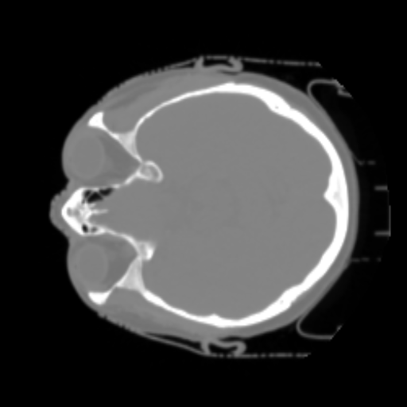
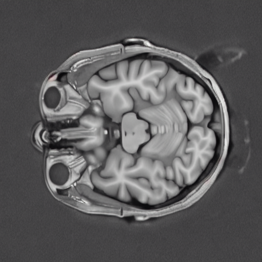
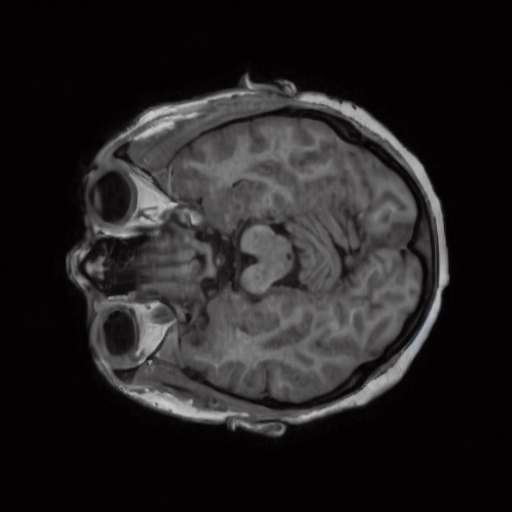
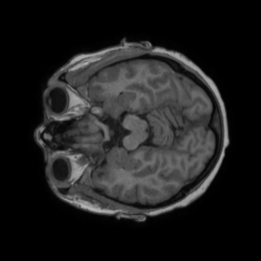
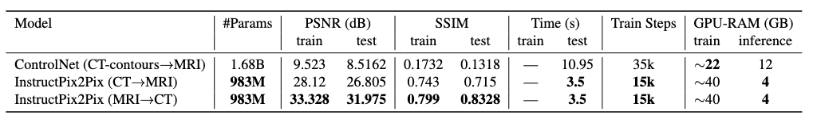

# 🖼️ Mediffuse: Diffusion-Driven Translation for MRI Generation from CT Scan

[](https://www.python.org/) [](https://d969b2857f0f723529.gradio.live/) [](https://huggingface.co/sauravdosi) 

---

## 🚀 Workflow


A quick overview of the end-to-end pipeline:

1. **Data Preparation:** Load paired CT–MRI scans, preprocess and tokenize.  
2. **Model Training:** Fine-tune diffusion models (InstructPix2Pix & ControlNet).  
3. **Inference:** Generate CT→MRI or MRI→CT translations via scripts or interactive Gradio.  
4. **Evaluation:** Quantitative (PSNR, SSIM) and qualitative (visual samples).

---

## 🚀 Features

- 🔄 **Bidirectional Conversion:** CT→MRI & MRI→CT on demand  
- 🤖 **ControlNet Extension:** Conditioning on segmentation masks or edge maps  
- ⚡ **Fast Inference:** Optimized for GPU acceleration  
- 🎨 **Interactive Demo:** Tweak prompts, adjust strength, visualize in real time  

---

## 🖼️ Results

### Qualitative:

| Input CT                         | Output MRI (Zero-Shot Stable Diffusion 1.5) | Output MRI (ControlNet)                | Output MRI (InstructPix2Pix)           | Output MRI (Ground Truth)              |
|----------------------------------------|---------------------------------------------|----------------------------------------|----------------------------------------|----------------------------------------|
|  |                   |  |  |  |

*Check out more examples in the `results/` folder or try the live demo above.*

---

### Quantitative:




## 📦 Installation

Ensure you have Python 3.10 and Conda installed.

```bash
conda create -n mediffuse python=3.10 -y  
conda activate mediffuse  
pip install -r requirements.txt
